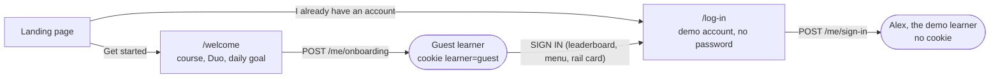
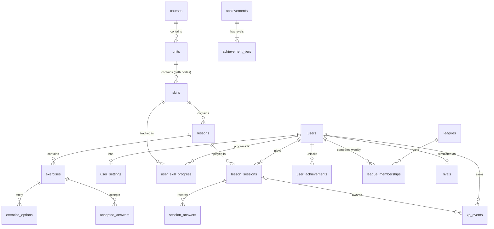

# Duolingo Clone

A full-stack web clone of [duolingo.com](https://www.duolingo.com): a Spanish course on a winding learning path,
six kinds of exercises, hearts, XP, streaks, weekly leagues against simulated rivals, achievements, quests, a shop
and settings with dark mode. It was built for the Scaler SDE assignment, with a **Next.js (TypeScript)** frontend
and a **FastAPI + SQLite** backend.

**Live demo:** [duolingo-clone-beryl-one.vercel.app](https://duolingo-clone-beryl-one.vercel.app)
· **API reference:** [interactive docs](https://duolingo-clone-production-2f05.up.railway.app/docs)
· **Build log:** [DOCUMENTATION.md](DOCUMENTATION.md)

Every screen was measured against duolingo.com itself (layout, spacing, colours and wording), and every game rule
runs on the server: the browser never sees an answer key and can't award itself XP.

---

## Contents

- [Try it in two minutes](#try-it-in-two-minutes)
- [The two ways in: "Get started" and "I already have an account"](#the-two-ways-in-get-started-and-i-already-have-an-account)
- [Features](#features)
- [Tech stack](#tech-stack)
- [Architecture](#architecture)
- [Project structure](#project-structure)
- [Running it locally](#running-it-locally)
- [Database](#database)
- [API](#api)
- [Game rules](#game-rules)
- [Testing](#testing)
- [Deployment](#deployment)
- [Assumptions and trade-offs](#assumptions-and-trade-offs)
- [What's next](#whats-next)
- [Further documentation](#further-documentation)

---

## Try it in two minutes

The landing page offers the same two ways in as duolingo.com:

| Button | You become | Good for |
| --- | --- | --- |
| **I already have an account** → LOG IN | **Alex**, the seeded demo account: partway through Unit 1, a 3-day streak, 30 XP, already in this week's Bronze league | Seeing every feature with data in it |
| **Get started** | A brand-new **guest**: pick a course and a daily goal, start at the first node | The new-learner experience |

The two are separate learners, so trying "Get started" never touches Alex's progress. How each path works is
explained [below](#the-two-ways-in-get-started-and-i-already-have-an-account).

Then, as Alex:

1. **Play a lesson.** Click the node with the START bubble on `/learn`. Try a wrong answer to lose a heart and see
   the red feedback bar. The finish screens show XP, accuracy and time, and the streak extends.
2. **Leaderboard.** You and 29 rivals ranked by this week's XP, with promotion and demotion zones.
3. **Profile.** Your stats, an "XP this week" chart and achievement badges.
4. **Settings → Demo tools** (MORE in the sidebar) lets you test time-based rules without waiting a day:
   - **Advance a day:** the streak continues or breaks, hearts regenerate, and the league week ends with a
     promotion or demotion.
   - **Empty hearts:** opens the out-of-hearts screen (refill with gems, or practise to earn one back).
   - **Reset the demo:** puts everything back as first seeded.

> The deployment is shared. Everyone who logs in plays the same Alex, so progress you see may be someone else's.
> "Reset the demo" restores the starting point.

---

## The two ways in: "Get started" and "I already have an account"

The brief says to assume a logged-in user, so there is no real sign-up or password. The app still offers both of
duolingo.com's entrances, and they lead to **two separate learners** in the database:

| | "Get started" | "I already have an account" |
| --- | --- | --- |
| Learner | **The guest** (`username: guest`, `is_guest: true`) | **Alex**, the demo account (`username: alex`) |
| Starts with | Nothing: the first node, 0 XP, no streak, 5 hearts, 500 gems | Seeded progress: 3 lessons done, 30 XP, a 3-day streak, two achievements, a place in this week's Bronze league |
| Profile | Not yet: asked to "Create a profile to save your progress!" | A full profile with stats, chart and achievements |
| Leaderboard | Locked: counts down 10 lessons, then asks the learner to sign in | Competes in the weekly league with 29 rivals |
| Progress kept | Until "Get started" is done again (which starts the guest over) | Until "Reset the demo" in Settings |



### Path 1: "Get started" makes a new guest

1. **Three screens at `/welcome`**, modelled on duolingo.com's onboarding:
   - **"I want to learn..."** lists every course. Only Spanish has content; the others say "coming soon".
   - **"Hi there! I'm Duo!"**
   - **"What's your daily learning goal?"** offers 5, 10, 15 or 20 minutes, stored as 10, 20, 30 or 50 XP.
2. **Nothing is saved until the last CONTINUE.** It then sends one `POST /api/v1/me/onboarding` with the course,
   the daily goal and the browser's time zone, so streak days follow the learner's own midnight.
3. **The server sets up the guest:**
   - The first time, it creates the one `guest` row in `users`. Every later time, it clears that row's history
     (lessons, answers, XP, path progress, achievements) and resets its stats, so the guest starts over.
   - Settings-page preferences, such as dark mode, carry over from whoever the browser was before.
   - Alex's row is never touched.
4. **The response sets a cookie,** `learner=guest` (HttpOnly, SameSite=Lax, for a year), and the browser opens
   `/learn` at the first node.
5. **As a guest, the learner plays normally.** Lessons, XP, hearts, streak, chests, achievements, the daily quest
   and settings all work. What differs follows duolingo.com's treatment of visitors without a profile:
   - The right rail shows **"Create a profile to save your progress!"** with CREATE A PROFILE ("coming soon")
     and SIGN IN.
   - **Profile** shows that prompt instead of a profile.
   - **Shop** says "You earned 500 gems! Create a profile to spend them in the store!"
   - **Leaderboard** counts down the 10 lessons that open leagues, like any new learner. After that it says
     **"You need to sign in to join the leaderboard"**, with a SIGN IN button. Leagues need an account, so a
     guest never joins one.

### Path 2: "I already have an account" logs in as Alex

1. **`/log-in`** is duolingo.com's log-in screen, measured against the real page. The username `alex` is filled
   in and there is no password ("No password needed for the demo"). Duolingo's Google, Facebook and Apple buttons
   are left out, as they would do nothing here.
2. **LOG IN sends `POST /api/v1/me/sign-in`.** The response clears the `learner` cookie, and the browser opens
   `/learn` as Alex.
3. **Coming from the guest,** the guest's preferences carry over to Alex. The guest's progress stays with the
   guest and is not merged, just as logging in to an existing account on duolingo.com doesn't merge a visitor's
   progress.
4. **Alex's progress is saved as it is made,** and stays until **Settings → Demo tools → Reset the demo**.

The same `/log-in` page is behind every SIGN IN a guest sees: on the leaderboard, in the right rail and in the
MORE menu. Its SIGN UP button leads to "Get started".

### How the server knows who is asking

One function, `get_current_user` in `backend/app/deps.py`, decides which learner a request belongs to. Every
endpoint that acts as "me" goes through it:

| The request... | Acts as |
| --- | --- |
| Carries the cookie `learner=guest`, and the guest exists | The guest |
| Carries no cookie (a fresh browser, after logging in, or opening `/learn` directly) | Alex |
| Carries the cookie, but the guest was removed by a demo reset | Alex |

The cookie is HttpOnly, so page scripts can't read or change it. It is first-party: the browser only ever talks
to the frontend's own domain, which forwards `/api/*` to the backend. **Reset the demo** deletes the guest,
restores Alex, the rivals and real time, and clears the cookie, so the browser is Alex afterwards.

The tests in `backend/tests/test_guest.py` cover each of these cases, including two browsers at once: one
finishes "Get started" while the other stays Alex.

**Limits.** There is one demo account and one guest. On the hosted demo, everyone who logs in shares Alex, and two
people in "Get started" at the same moment share the guest. Real accounts would replace `get_current_user` with a
lookup of the signed-in user, and nothing else would need to change.

---

## Features

### Core (from the brief)

| Feature | Where | Notes |
| --- | --- | --- |
| Learning path with locked, active and completed nodes | `/learn` | Units with sticky headers; a winding path with progress rings, treasure chests and unit-review trophies |
| Lessons with 5+ exercise types | `/lesson` | Multiple choice, word bank, match pairs, fill in the blank, type the answer, and listen ("Tap what you hear") |
| Feedback after each answer | `/lesson` | Duolingo's green and red bar, the correct solution, typo forgiveness ("You have a typo."), alternative answers |
| Hearts | everywhere | Lost on mistakes in lessons, regenerate over time, refilled with gems or earned back by practising |
| XP and daily goal | top bar, `/quests` | 10 XP per lesson and 5 per practice; a daily goal of 10/20/30/50 XP shown as the daily quest |
| Streak | top bar, celebration screen | Counted in the learner's own time zone; breaks after a missed day |
| Leaderboard | `/leaderboard` | Weekly leagues (Bronze to Diamond) of 30, with promotion and demotion |
| Profile | `/profile` | Stats, a 7-day XP chart, achievements |
| Shop and gems | `/shop` | Mocked gems (no payments) buy a heart refill |
| Settings | `/settings` | Duolingo's lesson switches (each one works), daily goal, dark mode; other sections are placeholders |
| Persistence | backend | Everything is stored in SQLite and survives restarts and redeploys |

### Bonus

| Feature | Notes |
| --- | --- |
| Audio | Spanish read aloud with the browser's text-to-speech; sound effects synthesised with the Web Audio API |
| Achievements | Wildfire (streak), Sage (XP), Scholar (lessons), Sharpshooter (perfect lessons), with levels and badges |
| Real leaderboard | 29 seeded rivals who keep "practising" through the week, deterministically, with no background job |
| Dark mode | System / On / Off, using duolingo.com's own dark palette |
| Responsive | Desktop and phone layouts measured against duolingo.com (sidebar → bottom tab bar on phones) |

### Placeholders (as the brief allows)

Creating a profile, friends, other courses (only Spanish has content), speaking exercises, and settings sections
such as Notifications and Privacy show a "coming soon" message. Logging in goes to the single demo account and
needs no password.

---

## Tech stack

| Layer | Choice | Why |
| --- | --- | --- |
| Frontend | **Next.js 16** (App Router), **React 19**, **TypeScript** | Required by the brief; file-based routing and a built-in proxy to the API |
| Styling | **Tailwind CSS v4** with design tokens in CSS variables | Duolingo's palette as tokens, so dark mode is a token swap |
| Animation | lottie-web (light build) | Duolingo's own Lottie animations, played without running embedded scripts |
| Backend | **FastAPI**, **Pydantic** | Typed request/response models and free interactive OpenAPI docs at `/docs` |
| Database | **SQLite** via **SQLAlchemy 2** (typed ORM), **Alembic** migrations | Required by the brief; the schema is versioned and the database enforces its own rules |
| Tests | **pytest**: 158 tests | Each test gets its own fresh database and a controllable clock |
| Hosting | **Vercel** (frontend), **Railway** (backend in Docker, SQLite on a persistent volume) | |

---

## Architecture

```
                 ┌───────────────────── Vercel ─────────────────────┐      ┌──────────── Railway ────────────┐
 browser ──────▶ │ Next.js: pages + React components                │      │ FastAPI (Docker, 1 worker)      │
                 │ /api/* rewrite ──────────────────────────────────┼────▶ │   routers → services → models   │
                 └──────────────────────────────────────────────────┘      │                  │              │
                                                                           │          SQLite on a volume     │
                                                                           └─────────────────────────────────┘
```

**The browser only ever calls its own site.** Next.js forwards `/api/...` to the backend, so there is no CORS
setup and no backend URL in client code.

**Inside the backend**, each layer has one job:

| Layer | Folder | Job |
| --- | --- | --- |
| Routers | `app/api/v1/` | HTTP only: parse the request, call a service, shape the response |
| Schemas | `app/schemas/` | Pydantic models for every request and response (these generate `/docs`) |
| Services | `app/services/` | All game rules: grading, hearts, streaks, XP, path unlocking, leagues, achievements |
| Models | `app/models/` | SQLAlchemy tables, with constraints the database enforces |
| Core | `app/core/` | Settings, database engine (foreign keys switched on for SQLite), clock, error format |

**Design principles**

- **Server-authoritative.** The server grades every answer and awards every point. Exercises reach the browser
  without solutions; the only exception is a listening sentence, which text-to-speech has to read aloud.
- **Store what happened, derive the rest.** Lessons, answers and XP are stored as history. Live hearts, today's
  XP, the streak, locked nodes and the weekly leaderboard are all computed when read, so no background job
  keeps them up to date.
- **An injectable clock.** Every service gets "now" from a clock object. Tests move it to any moment, and the
  demo tools move it forward a day, so time-based rules (streaks, heart regeneration, league weeks) can be tested.
- **One place decides who "me" is.** `get_current_user` in `backend/app/deps.py` picks the demo learner or the
  guest. Real authentication would replace that one function.
- **A registry of exercise types.** Each type is its own component under
  `frontend/src/components/lesson/exercises/`, so adding a type doesn't touch the lesson player.

---

## Project structure

```
duolingo-clone/
├── README.md                    ← you are here
├── DOCUMENTATION.md             ← the step-by-step build log: every page, rule and decision in detail
├── DATABASE.md                  ← schema reference: ER diagram, constraints, design decisions, migrations
├── API.md                       ← every endpoint with real request/response examples and error codes
│
├── backend/                     FastAPI + SQLAlchemy + SQLite
│   ├── app/
│   │   ├── main.py              app factory: migrations and seeding on startup, routers, error handlers
│   │   ├── deps.py              dependencies: database session, clock, current learner
│   │   ├── api/v1/              routers: me, courses, skills, sessions, leaderboard, demo
│   │   ├── schemas/             Pydantic request/response models
│   │   ├── services/            game rules: grading, hearts, streak, path, sessions, leagues, achievements
│   │   ├── models/              SQLAlchemy tables: content, learner, activity, achievements, leagues, demo
│   │   ├── seed/                the Spanish course, achievements, leagues, rivals and the demo learner (as data)
│   │   └── core/                config, database engine, clock, error envelope
│   ├── alembic/versions/        migrations 0001–0007
│   ├── tests/                   pytest suite (API, rules, constraints, migrations)
│   ├── Dockerfile, railway.json production image and Railway config
│   └── requirements*.txt
│
└── frontend/                    Next.js 16 + TypeScript + Tailwind v4
    ├── src/app/                 routes: / (landing), /welcome, /log-in, /lesson,
    │   └── (app)/               the signed-in shell: /learn, /leaderboard, /quests, /shop, /profile, /settings
    ├── src/components/          one folder per area: landing, onboarding, learn, lesson, leaderboard,
    │                            profile, quests, shop, settings, ui (Button, Modal…)
    ├── src/lib/                 API client and types, clock, preferences and theme, sounds, speech
    └── public/                  Duolingo's artwork, icons and animations (see "Brand assets")
```

---

## Running it locally

Requirements: **Python 3.12+** and **Node.js 20+**.

**1. Backend** (http://localhost:8000, interactive API docs at http://localhost:8000/docs)

```bash
cd backend
python -m venv .venv
.venv\Scripts\activate            # macOS/Linux: source .venv/bin/activate
pip install -r requirements-dev.txt
uvicorn app.main:create_app --factory --reload
```

On startup the API applies migrations and seeds the course, rivals and demo learner, so there is no separate setup
step. The database is created at `backend/data/app.db`.

**2. Frontend** (http://localhost:3000), in a second terminal:

```bash
cd frontend
npm install
npm run dev
```

Start the backend first. The frontend expects it at `http://localhost:8000`; to use another address, set
`API_URL` in `frontend/.env.local` (see `frontend/.env.example`). Backend settings come from environment variables
or `backend/.env` (see `backend/.env.example`).

| Useful commands | |
| --- | --- |
| `pytest` (in `backend/`) | Run the backend tests |
| `ruff check . && ruff format --check .` (in `backend/`) | Lint and format check |
| `python -m app.seed --reset` (in `backend/`) | Wipe all progress and seed again |
| `npm run build` / `npm run lint` (in `frontend/`) | Production build with type-check / ESLint |

---

## Database

SQLite through SQLAlchemy 2, versioned with Alembic (7 migrations). **20 tables in six groups:**

| Group | Tables | Changes at runtime? |
| --- | --- | --- |
| Content | `courses`, `units`, `skills`, `lessons`, `exercises`, `exercise_options`, `accepted_answers` | No, seeded |
| Learner | `users`, `user_settings`, `user_skill_progress` | Yes |
| Activity history | `lesson_sessions`, `session_answers`, `xp_events` | Append-only |
| Achievements | `achievements`, `achievement_tiers` (seeded), `user_achievements` | Unlocks only |
| Leagues | `leagues` (seeded), `league_memberships`, `rivals` | One row per learner per week |
| Demo tools | `demo_clock` | One row: how many days the demo has been moved forward |



**Key decisions** (each explained in [DATABASE.md](DATABASE.md)):

- **Normalised content.** Each exercise type's data lives in proper tables (options, accepted answers) rather
  than a JSON blob, so the database can check it.
- **XP is a ledger.** Every award is an `xp_events` row with the learner's local date; daily, weekly and total XP
  are sums of it, and `users.total_xp` is a cached running total.
- **Constraints in the database.** Foreign keys (switched on for SQLite), `CHECK`s (hearts within 0 and max,
  daily goal one of 10/20/30/50, non-negative gems), unique keys, and deliberate `CASCADE`, `RESTRICT` and
  `SET NULL` rules: answered content can't be deleted, but deleting a learner removes their history.
- **Lazy simulation.** Rivals are ordinary `users` rows, so standings use the same queries as for the learner.
  Their XP is written in when the leaderboard is read, from a random generator seeded by rival and date, so the
  result is the same whenever it is computed.
- **Time travel is one number.** "Advance a day" stores `demo_clock.days_ahead`; nothing else is rewritten.

---

## API

REST under `/api/v1`, JSON in and out. Every error has the same shape:
`{"error": {"code": "out_of_hearts", "message": "...", "details": ...}}`. The full reference, with real examples
for every endpoint and every error code, is in [API.md](API.md), and the running server serves it
interactively at `/docs`.

| Method | Path | Purpose |
| --- | --- | --- |
| GET | `/api/health` | Liveness check, including the database |
| GET | `/api/v1/me` | The learner with live stats: hearts after regeneration, streak, XP today |
| PATCH | `/api/v1/me` | Change the course, daily goal or time zone |
| POST | `/api/v1/me/onboarding` | Finish "Get started": the browser becomes a new guest |
| POST | `/api/v1/me/sign-in` | "I already have an account": back to the demo learner |
| POST | `/api/v1/me/hearts/refill` | Refill hearts for 350 gems |
| GET | `/api/v1/me/achievements` | Every achievement with level and progress |
| GET | `/api/v1/me/xp-history` | XP per day for the profile chart |
| GET / PATCH | `/api/v1/me/settings` | Settings-page preferences |
| GET | `/api/v1/courses` | The course catalogue with learner counts |
| GET | `/api/v1/courses/{course_id}/path` | Units and nodes, each completed, active or locked |
| POST | `/api/v1/skills/{skill_id}/open-chest` | Open a treasure chest (+20 gems) |
| POST | `/api/v1/sessions` | Start a lesson (or practice) on a node |
| GET | `/api/v1/sessions/current` | The session in progress (refreshing the page resumes it) |
| GET | `/api/v1/sessions/{session_id}` | One session, without solutions |
| POST | `/api/v1/sessions/{session_id}/answers` | Grade one answer |
| POST | `/api/v1/sessions/{session_id}/complete` | Finish: XP, streak, progress, achievements, league |
| POST | `/api/v1/sessions/{session_id}/quit` | Leave early |
| GET | `/api/v1/leaderboard` | This week's league: standings, zones, time left, last week's result |
| GET | `/api/v1/demo/clock` | How far the app's clock has been moved forward |
| POST | `/api/v1/demo/clock/advance` | Move it forward a day |
| POST | `/api/v1/demo/hearts/empty` | Lose every heart |
| POST | `/api/v1/demo/reset` | Everything back to the seeded state |

---

## Game rules

| Rule | Value |
| --- | --- |
| Path | Nodes unlock strictly in order. A lesson node has 2 lessons, a unit review 1. Unit 1 is playable (7 lessons, 42 exercises); Units 2 and 3 are "coming soon" |
| XP | 10 per lesson, 5 per practice session |
| Hearts | 5 at most. In a lesson a wrong answer or SKIP costs one; one regenerates every 30 minutes (shortened so the demo is testable). A lesson needs at least one heart to start |
| Getting hearts back | Practising a finished node earns one; a refill costs 350 gems |
| Gems | A new learner starts with 500; a treasure chest gives 20 |
| Streak | The day's first finished lesson extends it, by the learner's own midnight; a missed day resets it |
| Daily goal | 10, 20, 30 or 50 XP (Duolingo's 5, 10, 15, 20 minutes); resets at midnight |
| Grading | Case, punctuation and spacing never matter. Typed answers forgive one typo or a missing accent; several translations can be accepted |
| Mistakes | Wrong exercises come back at the end of the lesson ("Previous mistake") |
| Leaderboards | Open after 10 finished lessons. Weeks run Monday to Sunday; the top 7 move up a league and the bottom 5 move down. A guest is asked to sign in first |
| Achievements | Wildfire (3 → 365-day streak), Sage (100 → 30,000 XP), Scholar (5 → 50 lessons), Sharpshooter (3 → 50 perfect lessons); checked when a session finishes and never lost |

The values live in `backend/app/services/rules.py` and the seed data in `backend/app/seed/`.

---

## Testing

```bash
cd backend && pytest
```

158 tests, each against its own temporary database, with a clock the test controls. They cover:

- **The API end to end:** responses, error codes, the OpenAPI error shape.
- **The rules:** grading edge cases, heart regeneration, streaks across time zones and missed days, path
  unlocking, chests.
- **Lessons:** a full lesson, a full practice session, quitting.
- **Leagues and achievements:** promotion and demotion, rival simulation, and unlocking achievements.
- **The guest and sign-in flow.**
- **The database's own constraints,** and that every migration upgrades and downgrades cleanly.

The frontend is checked by TypeScript (`npm run build`) and ESLint. The UI was verified in a real browser
(Playwright) against duolingo.com, screen by screen.

---

## Deployment

```
GitHub main ──push──▶ Vercel  (Root Directory: frontend, env API_URL = Railway URL)
            └─push──▶ Railway (Root Directory: backend, Dockerfile, volume mounted at /data)
```

- **Backend (Railway).** Docker image from `backend/Dockerfile`, configured by `backend/railway.json`. The
  SQLite file sits on a persistent volume at `/data/app.db`, so progress survives redeploys. Railway waits for
  `GET /api/health` before switching traffic. The server runs a single worker, since SQLite allows one writer.
- **Frontend (Vercel).** Next.js with `API_URL` pointing at the Railway domain; Vercel forwards `/api/*` there.
- **First boot** migrates and seeds automatically; there are no manual steps.

Step-by-step setup instructions are in [DOCUMENTATION.md](DOCUMENTATION.md#deployment).

---

## Assumptions and trade-offs

- **A logged-in user is assumed, as the brief allows.** The demo learner (`alex`) is that user. "Get started"
  creates a separate guest, remembered by an HttpOnly cookie, and logging in returns the browser to Alex (see
  [the two ways in](#the-two-ways-in-get-started-and-i-already-have-an-account)). There is no password or real
  sign-up; real auth would replace a single function (`get_current_user`).
- **Shared demo state.** There is one demo account and one guest, so visitors to the hosted demo share them.
  "Reset the demo" restores the starting point.
- **Hearts regenerate every 30 minutes** (Duolingo takes hours), so a reviewer can see it happen.
- **Rivals are simulated**, deterministically and lazily, rather than being real users.
- **Only Spanish has content.** The other 38 courses are listed, as on duolingo.com, but are "coming soon".
- **Gems are mocked.** They come from the starting balance and treasure chests; nothing involves money.
- **Left out on purpose:** speaking exercises (they would need speech recognition), Duolingo's extra onboarding
  questions (nothing would use the answers), Power-Ups, and Google/Facebook/Apple sign-in.
- **SQLite with one worker** suits a demo. A multi-user production version would move to Postgres.
- **Brand assets.** The logo, illustrations, icons and animations in `frontend/public/` are Duolingo's own
  artwork, used only to reproduce the look of duolingo.com for a non-commercial assignment. They remain the
  property of Duolingo, Inc.; this project is not affiliated with Duolingo. Duolingo's fonts are proprietary, so
  Signika and Fredoka (Google Fonts) stand in.

---

## What's next

- A **timed "legendary" challenge**, the one bonus item not built yet.
- A dedicated **tablet** layout pass. Desktop and phone are done, and the in-between widths work but weren't
  separately polished.
- **Real accounts**, so each visitor gets their own learner instead of the shared demo account and guest.
- Content for Units 2 and 3, and more courses.
- Frontend component tests.

---

## Further documentation

| Document | What's in it |
| --- | --- |
| [DOCUMENTATION.md](DOCUMENTATION.md) | The step-by-step build log: each page as it was built and measured against duolingo.com, every rule, decision and trade-off, troubleshooting and deployment steps |
| [DATABASE.md](DATABASE.md) | The full ER diagram, every constraint, delete behaviour, how each exercise type is stored, what is derived rather than stored, seed data and migrations |
| [API.md](API.md) | Every endpoint with request and response examples, shared objects, conventions and the complete list of error codes |
