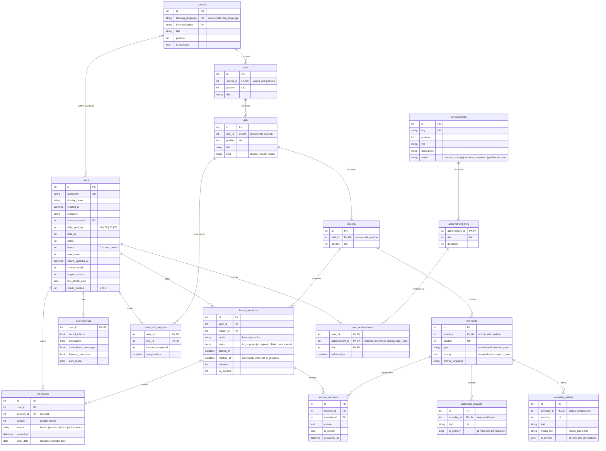

# Database design

SQLite, accessed through SQLAlchemy 2 and versioned with Alembic. The schema has **16 tables** in four groups:

| Group | Tables | Changes at runtime? |
| --- | --- | --- |
| Content | `courses`, `units`, `skills`, `lessons`, `exercises`, `exercise_options`, `accepted_answers` | No, seeded |
| Learner | `users`, `user_settings`, `user_skill_progress` | Yes |
| Activity history | `lesson_sessions`, `session_answers`, `xp_events` | Append-only; cleared only when the learner starts over |
| Achievements | `achievements`, `achievement_tiers` (seeded), `user_achievements` | Unlocks only |

The guiding rule: **store what happened, derive everything else when it is read.** Locked nodes, live hearts,
today's XP, the weekly leaderboard and the streak calendar are all computed from the rows below, so no background
job has to keep them up to date.

## ER diagram

## Rules the database enforces

Every rule below is a real constraint in SQLite, so bad data is refused even if application code has a bug.
Each one has a test in `backend/tests/test_constraints.py`.

| Table | Rule | How |
| --- | --- | --- |
| `users` | Hearts between 0 and `max_hearts`; gems, XP and streaks never negative; longest streak ≥ current streak | CHECK |
| `users` | Daily goal is 10, 20, 30 or 50 XP; at most 2 streak freezes | CHECK |
| `units`, `skills`, `lessons`, `exercises`, `exercise_options` | No two siblings share a `position` | UNIQUE (parent, position) |
| `skills`, `exercises`, `lesson_sessions`, `xp_events`, `achievements` | Kind, type, mode, status, source and metric come from a fixed list | CHECK … IN (…) |
| `exercises` | Every type except match pairs has a prompt | CHECK |
| `exercise_options` | At most one correct choice per exercise | Partial UNIQUE index (`WHERE is_correct`) |
| `accepted_answers` | At most one answer marked primary per exercise; no duplicate answers | Partial UNIQUE index, UNIQUE |
| `lesson_sessions` | `finished_at` is set exactly when the session is no longer in progress | CHECK |
| `xp_events` | Every event awards a positive amount | CHECK |
| `user_achievements` | A learner can only unlock a tier that exists | Composite FOREIGN KEY → `achievement_tiers` |

SQLite ignores foreign keys unless they are switched on for each connection; `backend/app/core/db.py` does that.

## What happens on delete

| Deleting… | Effect | Why |
| --- | --- | --- |
| A course, unit, skill, lesson or exercise | Everything beneath it is deleted (`CASCADE`) | Content only makes sense inside its parent |
| Content that a learner has already answered | Refused (`RESTRICT` from `lesson_sessions`, `session_answers`) | History must never disappear silently |
| A learner | Their settings, progress, sessions, answers, XP and unlocks go too (`CASCADE`) | Nothing of theirs is useful without them |
| A course someone is studying | Their `active_course_id` becomes NULL (`SET NULL`) | The learner stays |
| A lesson session | Its XP stays, with `session_id` set to NULL (`SET NULL`) | XP already earned is kept |
| A learner's history, when they finish "Get started" | Their progress, sessions, answers, XP events and unlocks are deleted; the `users` row is reset, settings kept | Signing up means a new account, and there is one built-in learner |

## How the five exercise types are stored

| Type | `exercises.prompt` | `exercise_options` | `accepted_answers` |
| --- | --- | --- | --- |
| Multiple choice | "the coffee" | 3–4 choices, one `is_correct` | — |
| Fill blank | "Yo ___ agua." | Choices, one `is_correct` | — |
| Word bank | Sentence to translate | Word tiles, distractors included | The correct sentence(s) |
| Type answer | Sentence to translate | — | Every accepted translation |
| Match pairs | — | One row per pair: `text` ↔ `match_text` | — |

Options and answers live in their own tables rather than a JSON blob per exercise. That lets the database
enforce "one correct option", and lets the server grade answers without ever sending them to the browser.

## Derived on read, never stored

| Value | Derived from |
| --- | --- |
| A path node is locked / available / completed | The previous node's `user_skill_progress.completed_at` |
| Progress ring on a node | `lessons_completed` ÷ number of lessons in the skill |
| Live hearts and "next heart in" | `users.hearts`, `hearts_updated_at` and the regeneration interval |
| Displayed streak (0 once a day is missed) | `current_streak`, `last_streak_date` and today in the learner's time zone |
| Today's XP, daily goal met | Sum of `xp_events.amount` for today's `local_date` |
| Weekly leaderboard | Sum of `xp_events.amount` per user for this week's dates |
| Streak calendar | Distinct `xp_events.local_date` values |
| Lesson accuracy | `session_answers` of the session |

## Design decisions

- **XP is a ledger.** Every gain is a row in `xp_events`; `users.total_xp` is only a running total kept for fast
  reads. XP needs a history because it is summed by day and by week. Gems only ever need a balance, so they are
  a counter on `users`.
- **Time.** Timestamps are stored in UTC (the `UTCDateTime` column type refuses naive datetimes). Streaks and the
  daily goal follow the learner's own calendar, so `xp_events.local_date` and `users.timezone` are stored too.
- **Wide `users` row, separate settings.** All game state the app reads on every page sits on `users`.
  Preferences that only the settings page uses live in a 1:1 `user_settings` table.
- **Path progress is a counter, not per-lesson rows.** Lessons inside a skill are played in order, so
  `lessons_completed` says exactly which ones are done.
- **No league tables.** The demo has one league: the leaderboard is this week's XP, ranked. Shop items are fixed
  prices in code.
- **Named constraints.** A naming convention (`backend/app/models/base.py`) gives every constraint and index a
  predictable name, so later migrations can refer to them.

## Seed data

The API seeds the database on startup, inserting only what is missing (`backend/app/seed/`), so restarts never
overwrite progress. `python -m app.seed --reset` starts from scratch.

| What | Details |
| --- | --- |
| Courses | 39 courses taught in English, in duolingo.com's order; only Spanish is available |
| Spanish content | 3 units, each with 5 path nodes: two lesson nodes, a treasure chest, a lesson node, and a unit review (15 nodes, 33 lessons). Defined as data in `backend/app/seed/spanish.py`. |
| Achievements | Wildfire (streak), Sage (XP), Scholar (lessons) and Sharpshooter (perfect lessons), 4 tiers each |
| The built-in learner | `alex`, studying Spanish with a 20 XP daily goal and 500 gems |
| Their history | 4 lessons finished on the 3 days before the first seed: the same rows a real lesson writes (a session, an XP event, path progress), plus a matching XP total and a 3-day streak. Finishing "Get started" clears it. |

## Migrations

| Revision | Adds |
| --- | --- |
| `0001` | `courses`, `users` |
| `0002` | The other 14 tables, and `users.streak_freezes` |
| `0003` | `review` path nodes (the trophy that ends each unit): widens the `skills.kind` CHECK |

Migrations run automatically when the API starts. On SQLite, Alembic changes a table by rebuilding it: copy,
drop the original, rename. With foreign keys on, SQLite would treat that drop as deleting every row and cascade
into child tables, so `backend/alembic/env.py` switches foreign keys off while migrating and runs
`PRAGMA foreign_key_check` at the end instead. A test checks that the migrations always match the models, and
another that upgrading keeps existing rows.
