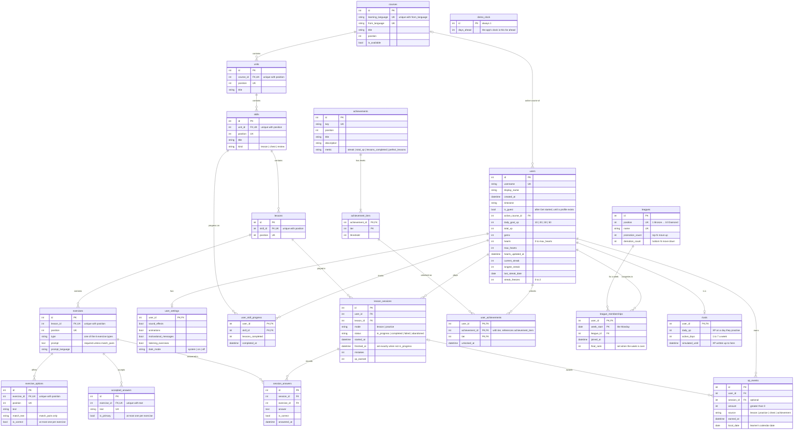

# Database design

SQLite, accessed through SQLAlchemy 2 and versioned with Alembic. The schema has **20 tables** in six groups:

| Group | Tables | Changes at runtime? |
| --- | --- | --- |
| Content | `courses`, `units`, `skills`, `lessons`, `exercises`, `exercise_options`, `accepted_answers` | No, seeded |
| Learner | `users`, `user_settings`, `user_skill_progress` | Yes |
| Activity history | `lesson_sessions`, `session_answers`, `xp_events` | Append-only; cleared only when the learner starts over |
| Achievements | `achievements`, `achievement_tiers` (seeded), `user_achievements` | Unlocks only |
| Leagues | `leagues` (seeded), `league_memberships`, `rivals` | A row per learner per week; rivals' simulation clock |
| Demo tools | `demo_clock` | One row, once a day has been advanced from the settings page |

The guiding rule: **store what happened, derive everything else when it is read.** Locked nodes, live hearts,
today's XP, the weekly leaderboard and the streak calendar are all computed from the rows below, so no background
job has to keep them up to date.

## ER diagram

`demo_clock` stands alone: it belongs to the app, not to a learner.

## Rules the database enforces

Every rule below is a real constraint in SQLite, so bad data is refused even if application code has a bug.
Each one has a test in `backend/tests/test_constraints.py`.

| Table | Rule | How |
| --- | --- | --- |
| `users` | Hearts between 0 and `max_hearts`; gems, XP and streaks never negative; longest streak ≥ current streak | CHECK |
| `users` | Daily goal is 10, 20, 30 or 50 XP; at most 2 streak freezes | CHECK |
| `units`, `skills`, `lessons`, `exercises`, `exercise_options` | No two siblings share a `position` | UNIQUE (parent, position) |
| `skills`, `exercises`, `lesson_sessions`, `xp_events`, `achievements` | Kind, type, mode, status, source and metric come from a fixed list | CHECK … IN (…) |
| `exercises` | Every type except match pairs has a prompt | CHECK |
| `exercise_options` | At most one correct choice per exercise | Partial UNIQUE index (`WHERE is_correct`) |
| `accepted_answers` | At most one answer marked primary per exercise; no duplicate answers | Partial UNIQUE index, UNIQUE |
| `lesson_sessions` | `finished_at` is set exactly when the session is no longer in progress | CHECK |
| `xp_events` | Every event awards a positive amount | CHECK |
| `user_achievements` | A learner can only unlock a tier that exists | Composite FOREIGN KEY → `achievement_tiers` |
| `league_memberships` | One league per learner per week; a final rank is 1 or more | PRIMARY KEY (user, week), CHECK |
| `leagues`, `rivals` | Zone sizes never negative; a rival practises on 1 to 7 days a week and earns some XP | CHECK |
| `user_settings` | Dark mode is `system`, `on` or `off` | CHECK … IN (…) |
| `demo_clock` | A single row (`id = 1`); the clock never runs behind real time (`days_ahead >= 0`) | CHECK |

SQLite ignores foreign keys unless they are switched on for each connection; `backend/app/core/db.py` does that.

## What happens on delete

| Deleting… | Effect | Why |
| --- | --- | --- |
| A course, unit, skill, lesson or exercise | Everything beneath it is deleted (`CASCADE`) | Content only makes sense inside its parent |
| Content that a learner has already answered | Refused (`RESTRICT` from `lesson_sessions`, `session_answers`) | History must never disappear silently |
| A learner | Their settings, progress, sessions, answers, XP, unlocks and league weeks go too (`CASCADE`) | Nothing of theirs is useful without them |
| A league someone has competed in | Refused (`RESTRICT` from `league_memberships`) | Past results must keep their league |
| A course someone is studying | Their `active_course_id` becomes NULL (`SET NULL`) | The learner stays |
| A lesson session | Its XP stays, with `session_id` set to NULL (`SET NULL`) | XP already earned is kept |
| A learner's history, when they finish "Get started" | Their progress, sessions, answers, XP events, unlocks and league weeks are deleted; the `users` row is reset and marked `is_guest`, settings kept | They start over as a new visitor, and there is one built-in learner |
| Everything, on "Reset the demo" (settings page) | Every `users` row (rivals included) and so, by `CASCADE`, all their rows; `demo_clock` too. The seed then runs again, and the learner's preferences are copied back | The demo returns to its first state without touching content |

## How the six exercise types are stored

| Type | `exercises.prompt` | `exercise_options` | `accepted_answers` |
| --- | --- | --- | --- |
| Multiple choice | "the coffee" | 3–4 choices, one `is_correct` | — |
| Fill blank | "Yo ___ agua." | Choices, one `is_correct` | — |
| Word bank | Sentence to translate | Word tiles, distractors included | The correct sentence(s) |
| Type answer | Sentence to translate | — | Every accepted translation |
| Match pairs | — | One row per pair: `text` ↔ `match_text` | — |
| Listen ("Tap what you hear") | The Spanish sentence, read aloud | Its words plus distractors, as tiles | The sentence |

Options and answers live in their own tables rather than a JSON blob per exercise. That lets the database
enforce "one correct option", and lets the server grade answers without ever sending them to the browser.

Every attempt is a `session_answers` row: wrong answers (and SKIP) too, and match pairs one pair at a time,
since a wrong pair costs a heart. A session's accuracy and "which exercises are done" are read from these rows.

## Derived on read, never stored

| Value | Derived from |
| --- | --- |
| A path node is locked / available / completed | The previous node's `user_skill_progress.completed_at` |
| Progress ring on a node | `lessons_completed` ÷ number of lessons in the skill |
| Live hearts and "next heart in" | `users.hearts`, `hearts_updated_at` and the regeneration interval |
| Displayed streak (0 once a day is missed) | `current_streak`, `last_streak_date` and today in the learner's time zone |
| Today's XP, daily goal met | Sum of `xp_events.amount` for today's `local_date` |
| The profile's "XP this week" chart | Sum of `xp_events.amount` per `local_date` over the last 7 days |
| Progress towards an achievement's next level | `users.longest_streak` (Wildfire), `users.total_xp` (Sage), completed `lesson_sessions` (Scholar), those with `mistakes = 0` (Sharpshooter) |
| Weekly standings | `league_memberships` for the week and league, each member's `xp_events.amount` summed over that week's `local_date`s |
| This week's league before a lesson joins it | The last finished week's `final_rank` and the league's zone sizes: up, down or the same league |
| Top 3 finishes | `league_memberships` with `final_rank` 1 to 3 |
| Streak calendar | Distinct `xp_events.local_date` values |
| Lesson accuracy | `session_answers` of the session |

## Design decisions

- **XP is a ledger.** Every gain is a row in `xp_events`; `users.total_xp` is only a running total kept for fast
  reads. XP needs a history because it is summed by day and by week. Gems only ever need a balance, so they are
  a counter on `users`.
- **Time.** Timestamps are stored in UTC (the `UTCDateTime` column type refuses naive datetimes). Streaks and the
  daily goal follow the learner's own calendar, so `xp_events.local_date` and `users.timezone` are stored too.
- **Wide `users` row, separate settings.** All game state the app reads on every page sits on `users`.
  Preferences that only the settings page uses live in a 1:1 `user_settings` table.
- **Achievement levels are stored; progress is not.** Every statistic an achievement measures only grows, so a
  level could be worked out on read too. It is stored in `user_achievements` anyway, when a session is finished,
  because that gives each level the time it was reached and lets the lesson's result screen announce exactly the
  levels that session reached. Progress towards the next level is always read live.
- **Path progress is a counter, not per-lesson rows.** Lessons inside a skill are played in order, so
  `lessons_completed` says exactly which ones are done.
- **Leagues store only what a week can't recompute later.** Standings are always summed from `xp_events`;
  `league_memberships` records who competed in which league each week, and the final rank once the week is
  over, because the next week's league and "top 3 finishes" depend on it. Weeks are ranked lazily, the first
  time the leaderboard is read or joined after they end.
- **Rivals are learners, simulated lazily.** The 29 rivals are ordinary `users` rows, so their XP, standings and
  totals use exactly the same tables and queries as the learner's. Their extra `rivals` row holds the knobs
  (`daily_xp`, `active_days`) and `simulated_until`: when the leaderboard is read, each rival's sessions since
  then are written as `xp_events`. A rival's day comes from a random generator seeded with their id and the
  date, so it is the same whenever it is worked out, and running it twice writes nothing twice.
- **Demo time travel is one stored number.** "Advance a day" doesn't rewrite any timestamps: it raises
  `demo_clock.days_ahead`, and every request reads the time from a clock that adds it to real time. Because
  streaks, hearts, rivals and league weeks are all derived from timestamps on read, they all move forward
  together, and resetting the demo is just deleting that row. It is a typed single-row table rather than a
  generic key-value table, so the database can check it.
- **Dark mode is a choice, not a flag.** duolingo.com offers System default, On and Off, so `dark_mode` stores
  one of those three words; the browser resolves "system" against the device's setting.
- **Fixed prices.** Shop items are fixed prices in code.
- **Named constraints.** A naming convention (`backend/app/models/base.py`) gives every constraint and index a
  predictable name, so later migrations can refer to them.

## Seed data

The API seeds the database on startup, inserting only what is missing (`backend/app/seed/`), so restarts never
overwrite progress. `python -m app.seed --reset` starts from scratch; "Reset the demo" in Settings does the same
for learners but keeps the content and the learner's preferences.

| What | Details |
| --- | --- |
| Courses | 39 courses taught in English, in duolingo.com's order; only Spanish is available |
| Spanish content | 3 units, each with 5 path nodes: two lesson nodes, a treasure chest, a lesson node, and a unit review (15 nodes). Lesson nodes have 2 lessons and reviews 1 (21 lessons). Unit 1 is playable: each of its 7 lessons has one exercise of every type (42 exercises). Units 2 and 3 have no exercises yet, so their lessons show "coming soon". Defined as data in `backend/app/seed/spanish.py`. |
| Leagues | The ten leagues, Bronze to Diamond; the top 7 move up and the bottom 5 down |
| Rivals | 29 learners studying Spanish, with how much and how often each practises, from a few keen ones to occasional ones (`data.RIVALS`). Their XP is simulated from the Monday of the week the database is seeded. |
| Achievements | Wildfire (longest streak: 3, 7, 14 ... 365 days) and Sage (total XP: 100, 250, 500 ... 30,000), with duolingo.com's 10 levels each; Scholar (lessons: 5, 10, 25, 50) and Sharpshooter (lessons without a mistake: 3, 10, 25, 50), 4 levels each. Defined in `backend/app/seed/data.py`; levels added there reach existing databases on the next start. |
| The built-in learner | `alex`, studying Spanish with a 20 XP daily goal and 500 gems |
| Their history | 3 lessons finished on the 3 days before the first seed: the same rows a real lesson writes (a session, an XP event, path progress), plus a matching XP total and a 3-day streak. That history reaches level 1 of Wildfire and Sharpshooter: on every start the seed stores any level the learner's progress already reaches. They are also already in this week's Bronze League with the rivals. Finishing "Get started" clears it all. |

## Migrations

| Revision | Adds |
| --- | --- |
| `0001` | `courses`, `users` |
| `0002` | The other 14 tables, and `users.streak_freezes` |
| `0003` | `review` path nodes (the trophy that ends each unit): widens the `skills.kind` CHECK |
| `0004` | `listen` exercises ("Tap what you hear"): widens the `exercises.type` CHECK |
| `0005` | `users.is_guest`: set when "Get started" starts the learner over, so the profile page asks them to create a profile; existing learners keep theirs (`false`) |
| `0006` | `leagues`, `league_memberships` and `rivals` |
| `0007` | `demo_clock`; `user_settings.dark_mode` becomes `system`, `on` or `off` (a stored "off" was only the old default, so it becomes `system`; "on" stays on) |

Migrations run automatically when the API starts. On SQLite, Alembic changes a table by rebuilding it: copy,
drop the original, rename. With foreign keys on, SQLite would treat that drop as deleting every row and cascade
into child tables, so `backend/alembic/env.py` switches foreign keys off while migrating and runs
`PRAGMA foreign_key_check` at the end instead. A test checks that the migrations always match the models, and
another that upgrading keeps existing rows.
